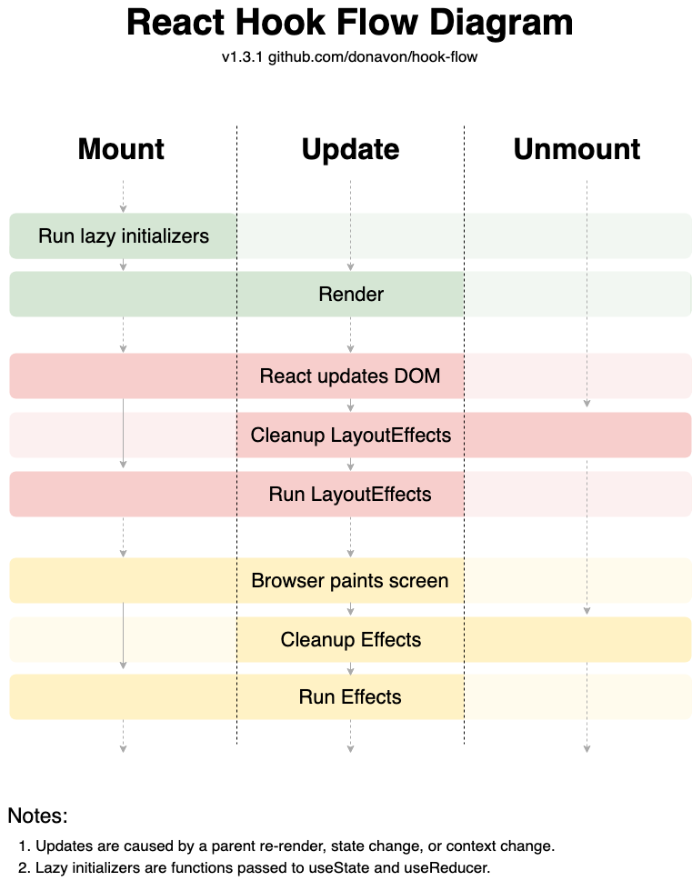

# useLayoutEffect

`useLayoutEffect`는 브라우저가 화면을 다시 그리기 전에 실행되는 `useEffect`입니다. 즉, `레이아웃(layout) 단계`가 지나 동기적으로 `useLayoutEffect`가 실행된 후 `페인트(paint) 단계`를 수행하게 됩니다.

리액트 훅 흐름 다이어그램

## 활용

브라우저가 페인트하기 전에 해야할 동작이 있다면 `useLayoutEffect`를 사용하면 좋습니다.
예를 들어, 툴팁의 위치를 잡아야 하는 경우, 위치가 동적일 때 툴팁 위치를 계산하고 페인트 되기전 위치를 다시 할당하여 한번에 깜빡임 없이 페인트가 됩니다.

## 주의할 점

`useLayoutEffect`가 동기적으로 실행되다보니 **브라우저의 렌더링 작업을 차단**할 수 있어 성능에 영향을 미칠 수 있습니다. 만약 렌더링 이후에 발생하는 작업이 레이아웃에 영향을 미치지 않고, 비동기 작업의 순서가 중요하지 않다면 `useEffect` 사용을 고려하는 것이 더 적절할 수 있습니다.

## REF

[리액트 공식문서 - useLayoutEffect](https://ko.react.dev/reference/react/useLayoutEffect)
